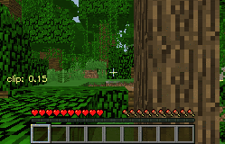

# CLIP4MC: An RL-Friendly Vision-Language Model for Minecraft
<div align="center">

[[Website]](https://sites.google.com/view/clip4mc) 
[[Arxiv Paper]](https://arxiv.org/pdf/2303.10571)

[](https://pypi.org/project/MineDojo/)
[](https://pytorch.org/)
[](https://github.com/PKU-RL/Plan4MC/blob/main/LICENSE)
______________________________________________________________________

</div>

CLIP4MC is a Vision-Language model for Minecraft, aligning actions implicitly contained in the video and transcript clips in addition to entities. We construct and release a neat vision-language dataset for Minecraft based on YouTube datset from [MineDojo](https://github.com/MineDojo/MineDojo), and we train our CLIP4MC model on the constructed dataset. Empirically, our method can provide a more friendly reward signal for the RL training procedure.

## Demonstrations  
Here are some demonstrations of agent trained with CLIP4MC.

|                  Harvest a leaf                  |                  Milk a cow                  |                  Shear a sheep                  |
|:------------------------------------------------:|:--------------------------------------------:|:-----------------------------------------------:|
|  |  |  |

## Requirements

### Packages
Install python packages in `requirements.txt`. 

Note that we require **PyTorch>=1.10.0** and **x-transformers==0.27.1**.

### Data
Dataset should get ready before training. 
Information of each data piece is available in our released [dataset](https://drive.google.com/drive/folders/19vDy2jaooF74MDt3dLAsyLRpRcUFKVCY?usp=sharing). 

In this project we provide a naive implementation of dataloader and dataset. To use the dataloader and dataset, the data should be organized in the following structure:
  ```
  data_dir_0
  ├── text_input.pkl
  ├── video_input.pkl
  data_dir_1
  ├── text_input.pkl
  ├── video_input.pkl
  ...
  data_dir_n
  ├── text_input.pkl
  ├── video_input.pkl
  ``` 
Tokenized and padded text (via CLIP tokenizer) and equidistantly-sampled frames are stored in `text_input.pkl` and `video_input.pkl` respectively and are supposed to be loaded via `pickle.load` function.

A log file for each dataset is also required. The log file should be a `json` file with the following structure:
  ```
  {
    "train": [data_dir_0, data_dir_1, ..., data_dir_n],
    "test" : [data_dir_0, data_dir_1, ..., data_dir_n],
  }
  ``` 
The `train` and `test` keys are required. The `train` key should contain a list of data directories for training. The `test` key should contain a list of data directories for testing.

### Pretrained Models

- A ViT-B-16 version of pretrained CLIP is required for training from scratch. You can download it from [here](https://openaipublic.azureedge.net/clip/models/5806e77cd80f8b59890b7e101eabd078d9fb84e6937f9e85e4ecb61988df416f/ViT-B-16.pt).

- The weight of our pretrained CLIP4MC model is available [here](https://drive.google.com/file/d/1q2oHJN38eyVKOeYnMXIei-_iT_rkqD3j/view?usp=share_link) for fine-tuning or evaluation.

## Usage

You can use the command pattern below to train the model.
`XXX` means a path to fill in. `[...]` means optional arguments. `{...}` means a choice of arguments.
```
torchrun --nproc_per_node=4 train_ddp.py --dataset_log_file XXX \ 
                                         [--use_pretrained_CLIP --pretrain_CLIP_path XXX \] 
                                         [--use_pretrained_model --pretrain_model_path XXX \] 
                                         --model_type {CLIP4MC,CLIP4MC_simple,MineCLIP}
```

## Citation
```bibtex
@article{ding2023clip4mc,
  title={CLIP4MC: An RL-Friendly Vision-Language Model for Minecraft},
  author={Ding, Ziluo and Luo, Hao and Li, Ke and Yue, Junpeng and Huang, Tiejun and Lu, Zongqing},
  journal={arXiv preprint arXiv:2303.10571},
  year={2023}
}
```


